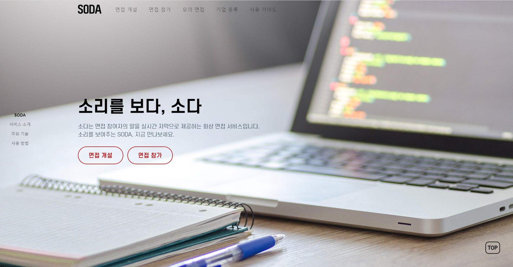
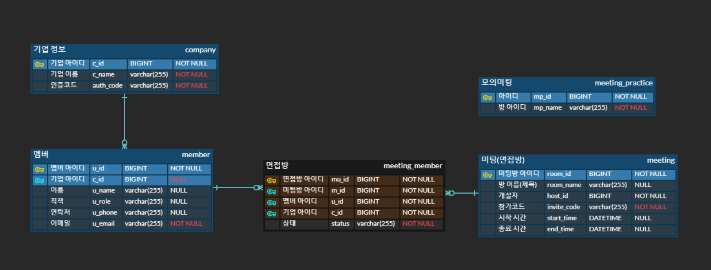
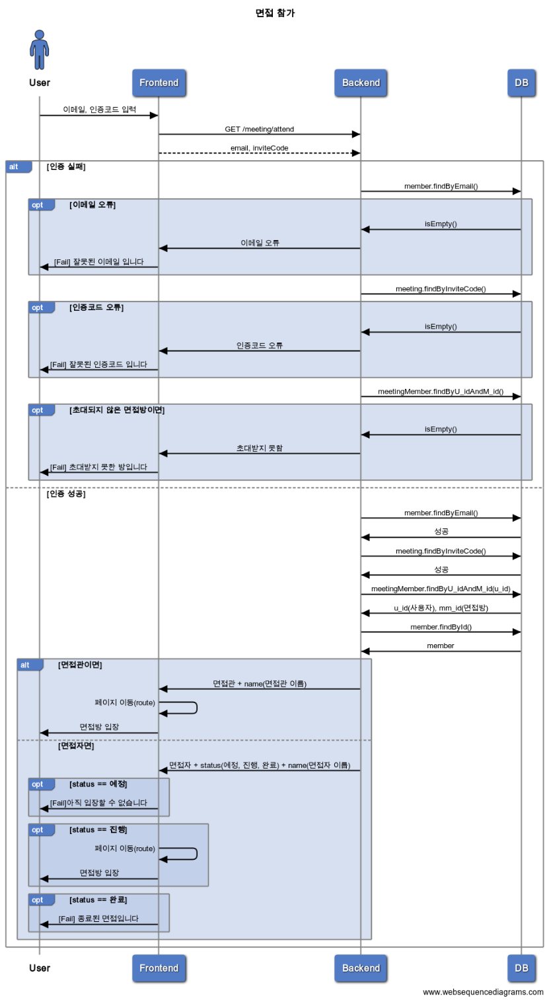
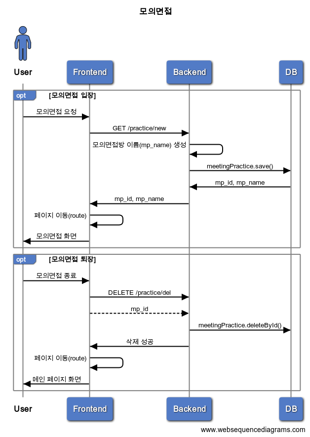

# SODA:소리를보다🦻👀

| **청각 장애인**을 위한 화상 **면접** 플랫폼

<div style="display:flex; justify-content: center;">
<p align="center">

  <a href="https://vuejs.org/">
    
  </a>
  <a href="https://vuetifyjs.com/en/">
      
  </a>
    <a href="https://spring.io/projects/spring-boot">
      
  </a>
    <a href="https://www.mysql.com/">
      
  </a>
    <a href="https://www.docker.com/get-started">
      
  </a>
    <a href="https://www.jenkins.io/">
      
  </a>
  <!--<a href="https://www.paypal.me/AmitMerchant">-->
  <a href="">
    
  </a>
</p>
</div>


<div style="display:flex; justify-content: center;">
<p align="center">
  

  
</p>
</div>

<h3 align="center">소다는 면접 참여자의 말을 실시간 자막으로 제공하는 화상 면접 서비스입니다.
소리를 보여주는 SODA, 지금 만나보세요. </h3>

<p align="center">
  <a href="https://k4d103.p.ssafy.io/">사이트 방문</a> 
  <!--• <a href="./docs/demo/README.md">데모(demo)</a> --> 
</p>



---

> 🚩 Table of Contents

- [SODA:소리를보다🦻👀](#soda소리를보다)
  - [✨주요 기능](#주요-기능)
  - [🐾 다이어그램](#-다이어그램)
    - [Entity Relationship Diagram](#entity-relationship-diagram)
    - [Sequence Diagrams](#sequence-diagrams)
  - [🌏 Browser Support](#-browser-support)
  - [📦 Packages (M)](#-packages-m)
    - [Frontend](#frontend)
    - [Backend](#backend)
  - [📚 준비하기](#-준비하기)
  - [🏁 실행하기](#-실행하기)
  - [🖥 배포하기](#-배포하기)
  - [👭팀 소개👨‍👨‍👦](#팀-소개)
  - [🚀 References](#-references)
  - [📜 License](#-license)

---

## ✨주요 기능

◻  **화상 면접 주최**

​	◽  로그인 후 이용할 수 있는 기능으로 참여자 이름 설정 후 미팅을 주최할 수 있도록 한다.

​	◽  미팅이 시작되면 참여자에게 보낼 수 있는 주소를 생성한다.

◻  **화상 면접 참여**

​	◽  로그인을 하지 않고 사용할 수 있는 기능으로 참여자 이름과 미팅주소만 입력하면 입장할 수 있도록 한다.

◻  **채팅**

​	◽  미팅에 참여한 사람들과 실시간으로 채팅을 할 수 있도록 구현한다.

◻  **자막 설정**

​	◽  청각장애인들에게 필요한 기능으로 참여자들의 음성을 인식하여 텍스트로 보여주는 기능을 구현한다.


## 🐾 다이어그램

### Entity Relationship Diagram



### Sequence Diagrams

- 기업등록


- 면접개설


- 면접방(면접자 관리)
.png)

- 면접참가


- 모의면접


---

## 🌏 Browser Support

|  Chrome |  Internet Explorer |  Edge |  Safari |  Firefox |
| :---------: | :---------: | :---------: | :---------: | :---------: |
| Yes | 10+ | Yes | Yes | Yes |


## 📦 Packages (M)

###  Frontend

| Name | Version |
| --- | --- |
| [`@eslint-config-prettier`]() | 8.2.0 |
| [`@moment`]() | 2.29.1 |
| [`@openvidu-browser`]() | 2.17.0 |
| [`@sweetalert2`](https://sweetalert2.github.io/) | 10.16.6 |
| [`@axios`](https://github.com/axios/axios) | 0.21.1 |
| [`@vuetify`](https://vuetifyjs.com/en/) | 2.4.11 |
| [`@vue-router`](https://github.com/vuejs/vue-router#readme) | 3.5.1 |
| [`@vuex`](https://github.com/vuejs/vuex#readme) | 3.4.0 |
| [`@eslint`]() | 5.16.0 |
| [`@prettier`]() | 2.2.1 |


### Backend

| Name | Description |
| --- | --- |
| [`$mysql`]() | MySQL connector |
| [`$jpa`]() | Java Persistence API  |
| [`$lombok`]() | getter, setter 등의 메서드 작성 코드를 줄여주는 코드 다이어트 라이브러리 |
| [`$junit`]() | Testing Tool |
| [`$stmp`]() | Spring boot starter email |
| [`$thymeleaf`]() | View Template(뷰 템플릿) |
| [`$thymeleaf-layout-dialect`]() | 뷰 템플릿 스타일 관련 |
| [`$swagger`]() | REST 웹 서비스를 설계, 빌드, 문서화, 소비하는 일을 도와주는 대형 도구 생태계의 지원을 받는 오픈 소스 소프트웨어 프레임워크 |

</br>

## 📚 준비하기

> DB 생성하고 설정 파일 application.properties(백엔드), .env(프론트엔드) 파일 생성 및 추가하시면 됩니다
> 
1. Git clone 받기

```
git clone https://lab.ssafy.com/s04-final/s04p31d103.git
```

2. 데이터베이스 준비

- 'soda' 테이터베이스 생성

```
CREATE SCHEMA `soda`;
```

1. [**Backend**] application.properties 설정

- backend\src\main\resources 폴더 아래 생성하시면 됩니다
- mysql 도메인과 아이디/비번 작성

```
# Server Setting
#server.address=k4d103.p.ssafy.io

server.port=8889
server.servlet.context-path=/restapi

# Encoding
spring.http.encoding.force=false

# show SQL on console
spring.jpa.show-sql=true

# use DDL DB
spring.jpa.generate-ddl=true
spring.jpa.hibernate.ddl-auto= update


# Mysql
spring.jpa.database=mysql

# DB setting
spring.datasource.url=jdbc:mysql://{도메인주소}:3306/soda?useSSL=false&characterEncoding=UTF-8&serverTimezone=UTC
spring.datasource.username={DB 계정 아이디}
spring.datasource.password={DB 계정 비번}
spring.datasource.driver-class-name=com.mysql.cj.jdbc.Driver

spring.jpa.database-platform=org.hibernate.dialect.MySQL5InnoDBDialect
# devtool
spring.devtools.livereload.enabled=true

# mail
spring.mail.default-encoding=UTF-8
spring.mail.host=smtp.gmail.com
spring.mail.port=587
spring.mail.username={이메일 주소}
spring.mail.password={이메일 비번}
spring.mail.properties.mail.smtp.starttls.enable=true
spring.mail.properties.mail.smtp.starttls.required=true
spring.mail.properties.mail.smtp.auth=true
```

4. [Frontend] .env 작성

- frontend 폴더 아래 생성하시면 됩니다
- nginx에 명시된 location을 따라갑니다

```
VUE_APP_API_URL={도메인주소}/restapi/
```

5. [Frontend] 모듈 다운로드

```
# frontend 폴더로 이동해서 다운
cd frontend/soda
npm install
```

6. [Backend] (Option) Spring boot를 build(jar 파일 생성)

```
# backend 폴더로 이동해서
cd backend/
mvn -B -DskipTests -f backend
```

<br />

## 🏁 실행하기

1. 백엔드 실행

- 생성한 jar 파일 실행

```
java -jar [filename].jar
```

- 혹은 war 파일 생성하지 않고 demon으로 로컬에서 실행하고 싶다면 STS와 같은 IDEA에서 Spring boot Run을 실행하거나 아래 명령어를 통해 실행

```
mvn spring-boot:run
```

2. 프론트엔드 실행

```
yarn serve
```

<br />

## 🖥 배포하기

해당 서비스는 AWS EC2를 통해 배포하였고
Docker와 Jenkins를 이용해 CI/CD 구축하였습니다:

1. AWS EC2 인스턴스 생성 (ubuntu)
2. docker 설치
3. 필요한 이미지를 docker hub를 통해 설치
   1. Jenkins
   2. MySQL
4. Jenkins와 Gitlab repository 연동
5. MySQL 컨테이너에 `soda` DB 스키마 생성
6. Nginx 설정 (frontend/nginx 폴더의 homepage.conf)
7. frontend, backend 폴더 안에 dockerfile 작성
8. 프로젝트 root 위치에 Jenkins 파일 작성
   1. Build and Test 과정
   2. Build (frontend, backend)
   3. Run (컨테이너 실행)
9. `docker ps` 를 통해 frontend, backend 컨테이너가 실행되는 것을 확인 (Jenkins, MySQL 포함)

<br />


## 👭팀 소개👨‍👨‍👦

**김태진** : Backend

**김유리** : Frontend

**김지은** : Frontend, 팀장

**백규태** : Frontend

**조희은** : Frontend

## 🚀 References

- [Markdownify - README.md](https://github.com/amitmerchant1990/electron-markdownify#related)
- [TOAST UI Editor - README.md](https://github.com/nhn/tui.editor#readme)


## 📜 License

This software is licensed under the [MIT](.docs/LICENSE) © [SSAFY](https://www.ssafy.com/ksp/jsp/swp/swpMain.jsp).